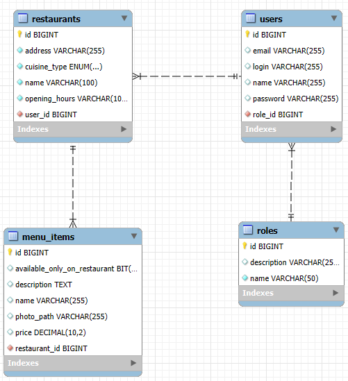
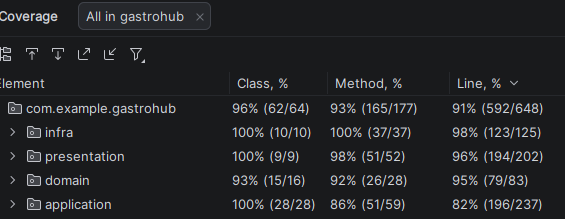

# GastroHub

GastroHub é um sistema de gestão compartilhado para restaurantes. Sistema permite cadastro de usuários, restaurantes e itens de cardápio com arquitetura limpa (Clean Architecture) e Spring Boot.

---

## Stack

| Tecnologia | Versão |
|---|---|
| Java | 21 |
| Spring Boot | 4.1.0 |
| Spring Data JPA / Hibernate | 7.4 |
| Spring Web MVC | — |
| Jakarta Validation | — |
| Lombok | — |
| Maven | 3.9+ |
| H2 Database | dev (embedded) |
| MySQL 8.0 | produção / Docker |
| Flyway | migrações (hml/prd) |
| Docker | 24+ |

---

## Estrutura do projeto

```
src/main/java/com/example/gastrohub/
├── GastrohubApplication.java              # Entry point Spring Boot
├── domain/                                # Camada de domínio (sem frameworks)
│   ├── user/                              # Usuário + UserRole enum
│   ├── restaurant/                        # Restaurante + CuisineType enum
│   ├── menuitem/                          # Item do cardápio
│   └── role/                              # Papéis/funções do sistema
├── application/                           # Casos de uso + DTOs + mappers
│   ├── user/
│   ├── restaurant/
│   ├── menuitem/
│   └── role/
├── infra/
│   └── persistence/                       # JPA entities + repositories + adapters
│       ├── entity/                        # UserJpaEntity, RestaurantJpaEntity, MenuItemJpaEntity
│       ├── repository/                    # Spring Data JPA interfaces
│       ├── mapper/                        # Mapeamento JPA <-> Domain
│       ├── adapter/                       # Implementação dos Gateways
│       └── role/                          # Role persistence (entity/repo/mapper/adapter)
└── presentation/                          # Controllers REST + exception handler
    ├── user/
    ├── menuitem/
    ├── role/
    └── exception/                         # GlobalExceptionHandler (RFC 7807)

src/main/resources/
├── application.yml                        # Configuração centralizada com perfis
└── db/
    └── migration/
        └── V1__init.sql                   # Migração Flyway (MySQL)

src/test/java/com/example/gastrohub/
├── GastrohubApplicationTests.java          # Smoke test
├── application/restaurant/                # Testes use cases Restaurant
├── application/menuitem/                  # Testes use cases MenuItem
├── application/role/                      # Testes use cases Role
└── application/user/                      # Testes use cases User
```

---

## Perfis

| Perfil | Banco | DDL | Flyway | Uso |
|---|---|---|---|---|
| `dev` (padrão) | H2 em memória | `update` | disabled | Desenvolvimento local |
| `hml` | MySQL (env vars) | `validate` | enabled | Homologação |
| `prd` | MySQL (env vars) | `validate` | enabled | Produção |

Ativar perfil: `--spring.profiles.active=hml`

---

## Banco de dados

### Modelo relacional

```
roles (1) --- (N) users (1) --- (N) restaurants (1) --- (N) menu_items
```

### users

| Coluna | Tipo | Restrições |
|---|---|---|
| id | BIGINT | PK, AUTO_INCREMENT |
| name | VARCHAR(150) | NOT NULL |
| email | VARCHAR(200) | NOT NULL, UNIQUE |
| login | VARCHAR(50) | NOT NULL, UNIQUE |
| password | VARCHAR(255) | NOT NULL |
| role_id | BIGINT | FK → roles(id), NOT NULL |

### restaurants

| Coluna | Tipo | Restrições |
|---|---|---|
| id | BIGINT | PK, AUTO_INCREMENT |
| name | VARCHAR(200) | NOT NULL |
| address | VARCHAR(500) | NOT NULL |
| cuisine_type | VARCHAR(100) | NOT NULL |
| opening_hours | VARCHAR(200) | NOT NULL |
| user_id | BIGINT | FK → users(id), NOT NULL |

### menu_items

| Coluna | Tipo | Restrições |
|---|---|---|
| id | BIGINT | PK, AUTO_INCREMENT |
| name | VARCHAR(200) | NOT NULL |
| description | TEXT | — |
| price | DECIMAL(10,2) | NOT NULL |
| available_only_on_restaurant | BOOLEAN | NOT NULL, DEFAULT FALSE |
| photo_path | VARCHAR(500) | — |
| restaurant_id | BIGINT | FK → restaurants(id), NOT NULL |

### roles

| Coluna | Tipo | Restrições |
|---|---|---|
| id | BIGINT | PK, AUTO_INCREMENT |
| name | VARCHAR(50) | NOT NULL, UNIQUE |
| description | VARCHAR(255) | — |

---


## Como executar

### Pré-requisitos

- Java 21
- Maven 3.9+
- Docker 24+ e Docker Compose 2.20+ (para MySQL)

### Local (H2 em memória — dev)

```bash
cd gastrohub
./mvnw spring-boot:run
```

Aplicaçao inicia com H2 na porta `8080`. Tabelas criadas automaticamente.
Console H2: `http://localhost:8080/h2-console` (JDBC URL: `jdbc:h2:mem:gastrohub`)

### Docker (MySQL — hml/prd)

```bash
docker compose build
docker compose up -d
docker compose logs -f gastrohub-api
```

### Perfil específico

```bash
# HML
./mvnw spring-boot:run -Dspring-boot.run.profiles=hml

# PRD
./mvnw spring-boot:run -Dspring-boot.run.profiles=prd
```

### Variáveis de ambiente

| Variável | Padrão (dev) | Padrão (hml/prd) |
|---|---|---|
| `DB_URL` | `jdbc:h2:mem:gastrohub` | `jdbc:mysql://localhost:3306/gastrohub` |
| `DB_USERNAME` | `sa` | `root` |
| `DB_PASSWORD` | vazio | `root` |
| `DB_DRIVER` | `org.h2.Driver` | `com.mysql.cj.jdbc.Driver` |
| `DB_DIALECT` | `org.hibernate.dialect.H2Dialect` | `org.hibernate.dialect.MySQLDialect` |

---

## Endpoints

### Users

| Método | Path | Descrição |
|---|---|---|
| POST | `/users` | Criar usuário |
| GET | `/users` | Listar usuários |
| GET | `/users/{id}` | Buscar usuário por ID |
| PUT | `/users/{id}` | Atualizar usuário |
| PATCH | `/users/{id}/role` | Atualizar role do usuário |
| DELETE | `/users/{id}` | Remover usuário |

### Restaurants

| Método | Path | Descrição |
|---|---|---|
| POST | `/restaurants` | *Controller não implementado* |
| GET | `/restaurants` | *Controller não implementado* |
| GET | `/restaurants/{id}` | *Controller não implementado* |
| GET | `/restaurants/name/{name}` | *Controller não implementado* |
| PUT | `/restaurants/{id}` | *Controller não implementado* |
| DELETE | `/restaurants/{id}` | *Controller não implementado* |

### Menu Items

| Método | Path | Descrição |
|---|---|---|
| POST | `/restaurants/{restaurantId}/menu-items` | Criar item |
| GET | `/restaurants/{restaurantId}/menu-items` | Listar itens do restaurante |
| GET | `/menu-items/{id}` | Buscar item por ID |
| PUT | `/menu-items/{id}` | Atualizar item |
| DELETE | `/menu-items/{id}` | Remover item |

### Roles

| Método | Path | Descrição |
|---|---|---|
| POST | `/roles` | Criar role |
| GET | `/roles` | Listar roles |
| GET | `/roles/{id}` | Buscar role por ID |
| PUT | `/roles/{id}` | Atualizar role |
| DELETE | `/roles/{id}` | Remover role |

---

## Configuração

### application.yml

Configuração centralizada em `src/main/resources/application.yml` com perfis `dev`, `hml` e `prd`. Em dev, H2 + ddl-auto. Em hml/prd, MySQL + Flyway.

### Flyway

Migrações em `src/main/resources/db/migration/`. Ativado apenas nos perfis `hml` e `prd`. Em dev, Hibernate gerencia o schema via `ddl-auto=update`.

### settings.xml

`.mvn/settings.xml` contém configuração Maven com mirrors para Maven Central e Spring Milestones. Ignorado pelo `.gitignore`.

---

## Testes

```bash
./mvnw test
```

Atualmente **150 testes**, todos passando:
- Use cases Restaurant
- Use cases MenuItem
- Use cases User
- Use cases Role
- Domain Restaurant validation
- Smoke test
- User-Role vínculo
- MenuItem CRUD
  

---

## Acessos

| Serviço | URL / Credenciais |
|---|---|
| API | http://localhost:8080 |
| MySQL | localhost:3306, user `gastrohub`, pass `gastrohub123` |
| H2 Console | http://localhost:8080/h2-console (apenas dev) |
